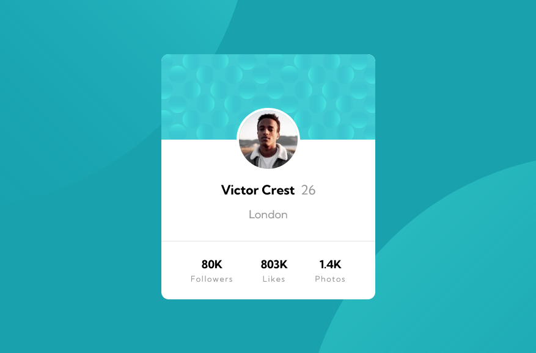

# Frontend Mentor - Profile card component solution

This is a solution to the [Profile card component challenge on Frontend Mentor](https://www.frontendmentor.io/challenges/profile-card-component-cfArpWshJ). Frontend Mentor challenges help you improve your coding skills by building realistic projects.

## Table of contents

-   [Overview](#overview)
    -   [Screenshot](#screenshot)
    -   [Links](#links)
-   [My process](#my-process)
    -   [Built with](#built-with)
    -   [What I learned](#what-i-learned)
    -   [Continued development](#continued-development)
    -   [Useful resources](#useful-resources)

## Overview

### Screenshot



### Links

-   Solution URL: [URL here]()
-   Live Site URL: [Github Pages]()

## My process

### Built with

-   CSS custom properties
-   Flexbox

### What I learned

-   Using margin: auto on flex-item instead justify-content: center to avoid non-accessible which appear when flex item exceed the size of flex container

```css
/* center flex item using align-item combine with margin auto */
.flex-container {
    display: flex;
    align-items: center;
}
.flex-item {
    margin: 0 auto;
}
```

Read about problem [here](https://stackoverflow.com/questions/44244549/whats-the-difference-between-marginauto-and-justify-content-align-items-cent)

-   Insert 2 background image and customize its

```css
body {
    background-image: url("images/bg-pattern-top.svg"),
        url("images/bg-pattern-bottom.svg");
    background-repeat: no-repeat, no-repeat;
    background-color: var(--dark-cyan);
    background-position: right 52vw bottom 42vh, left 54vw top 44vh;
}
```

-   Using border-radius: 50% to create circle

-   If we need to center text only, just use

```css
text-align: center;
```

### Continued development

-   background-position
